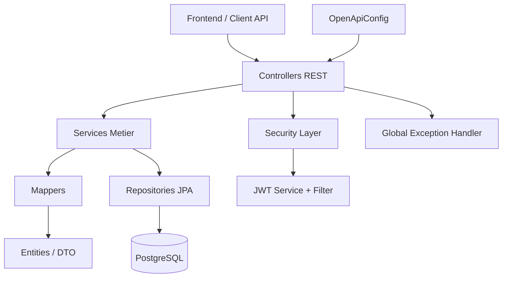
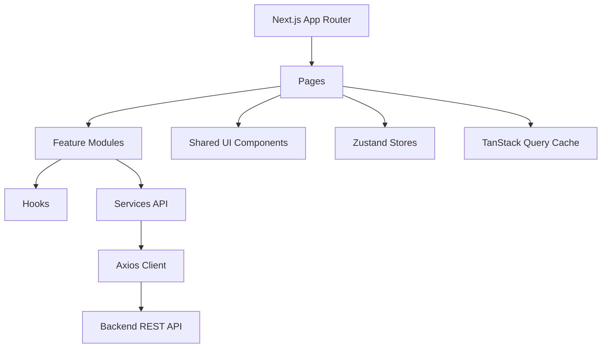

# Documentation detaillee du projet STOCKPRO

## 1) Resume du projet

STOCKPRO est une application ERP orientee gestion/administration avec:
- un backend Java Spring Boot expose en API REST
- un frontend Next.js (React + TypeScript) avec App Router
- une base PostgreSQL geree par Flyway
- une authentification JWT et un systeme de droits/permissions

Le projet est organise en deux modules principaux:
- `backend/`
- `frontend/`

---

## 2) Stack technique

### Backend
- Java 17
- Spring Boot 3.5.4
- Spring Web
- Spring Data JPA
- Spring Security
- Validation (Bean Validation)
- PostgreSQL
- Flyway (migrations SQL versionnees)
- JWT (`jjwt`)
- OpenAPI/Swagger (`springdoc`)
- Lombok
- Maven

### Frontend
- Next.js 15.1.11
- React 19
- TypeScript
- Tailwind CSS
- Axios
- TanStack Query
- Zustand
- React Hook Form + Zod
- Framer Motion

---

## 3) Architecture Backend

Le backend suit une architecture en couches classique.

### 3.1 Couches
- `controller/`: expose les endpoints REST
- `service/`: contient la logique metier
- `repository/`: acces aux donnees via Spring Data JPA
- `entity/`: modeles persistants (tables)
- `dto/`: objets de transfert API
- `mapper/`: conversion Entity <-> DTO
- `security/`: JWT, filtres, configuration de securite
- `exception/`: gestion globale des erreurs
- `config/`: configuration technique (OpenAPI)

### 3.2 Diagramme d architecture backend

### 3.3 Flux principal backend
1. Le frontend appelle un endpoint REST.
2. Le filtre JWT valide le token et charge le contexte securite.
3. Le controller valide la requete et delegue au service.
4. Le service applique les regles metier et interroge le repository.
5. Le mapper convertit entity <-> dto.
6. La reponse est renvoyee en JSON.

---

## 4) Architecture Frontend

Le frontend est structure par fonctionnalites (feature-first) au-dessus de Next.js App Router.

### 4.1 Organisation
- `src/app/`: routes Next.js (pages, layouts, providers)
- `src/features/`: logique metier par domaine (auth, administration, dashboard)
- `src/components/ui/`: composants UI reutilisables
- `src/layouts/`: layout dashboard (sidebar, topbar, footer)
- `src/lib/`: clients/config transverses (axios, queryClient, permissions)
- `src/store/`: etat global (Zustand)
- `src/utils/`: utilitaires

### 4.2 Diagramme d architecture frontend

### 4.3 Flux principal frontend
1. L utilisateur accede a une route (`app/.../page.tsx`).
2. La page appelle une feature (page metier + hook).
3. Le hook declenche une requete (TanStack Query + service Axios).
4. Le backend repond; la vue est mise a jour.
5. Les guards (auth/permission) controlent l acces.

---

## 5) Communication Frontend <-> Backend

- Protocole: HTTP/JSON
- Authentification: JWT
- Autorisation: droits/permissions (niveau fonctionnalites/profils/roles)
- CORS: configure via `app.cors.allowed-origins`
- Documentation API: OpenAPI/Swagger (`/v3/api-docs`, `/swagger-ui.html`)

---

## 6) Configuration et execution

### Backend
- Build/Test: Maven (`mvnw`, `pom.xml`)
- Variables principales:
  - `DB_URL`, `DB_USERNAME`, `DB_PASSWORD`
  - `JWT_SECRET`, `JWT_EXPIRATION_MS`
  - `SERVER_PORT`
  - `CORS_ALLOWED_ORIGINS`
- Migrations: `backend/src/main/resources/db/migration/*.sql`

### Frontend
- Scripts npm:
  - `npm run dev`
  - `npm run build`
  - `npm run start`
  - `npm run lint`
- Exemple env: `frontend/.env.example`

---

## 7) Inventaire des fichiers du projet

Important:
- La liste ci-dessous couvre les fichiers source et configuration du projet.
- Les dossiers de dependances/build volumineux ne sont pas enumeres ligne par ligne:
  - `frontend/node_modules/`
  - `frontend/.next/`
  - `backend/target/`
  - `backend/.idea/`

### 7.1 Racine workspace
- `.gitignore`
- `DOCUMENTATION_PROJET_STOCKPRO.md`

### 7.2 Backend
- `backend/.gitattributes`
- `backend/.gitignore`
- `backend/HELP.md`
- `backend/mvnw`
- `backend/mvnw.cmd`
- `backend/pom.xml`
- `backend/.mvn/wrapper/maven-wrapper.properties`
- `backend/src/main/java/com/stockpro/StockproApplication.java`
- `backend/src/main/java/com/stockpro/config/OpenApiConfig.java`
- `backend/src/main/java/com/stockpro/controller/administration/ApplicationController.java`
- `backend/src/main/java/com/stockpro/controller/administration/FonctionnaliteController.java`
- `backend/src/main/java/com/stockpro/controller/administration/GroupeController.java`
- `backend/src/main/java/com/stockpro/controller/administration/GroupeProfilController.java`
- `backend/src/main/java/com/stockpro/controller/administration/GroupeRoleController.java`
- `backend/src/main/java/com/stockpro/controller/administration/ProfilController.java`
- `backend/src/main/java/com/stockpro/controller/administration/ProfilDroitController.java`
- `backend/src/main/java/com/stockpro/controller/administration/RoleController.java`
- `backend/src/main/java/com/stockpro/controller/administration/SiteController.java`
- `backend/src/main/java/com/stockpro/controller/administration/UserController.java`
- `backend/src/main/java/com/stockpro/controller/administration/UserSiteController.java`
- `backend/src/main/java/com/stockpro/controller/administration/UserSiteDroitsController.java`
- `backend/src/main/java/com/stockpro/controller/audit/AuditLogController.java`
- `backend/src/main/java/com/stockpro/controller/auth/AuthController.java`
- `backend/src/main/java/com/stockpro/dto/administration/ApplicationDTO.java`
- `backend/src/main/java/com/stockpro/dto/administration/FonctionnaliteDTO.java`
- `backend/src/main/java/com/stockpro/dto/administration/GroupeDTO.java`
- `backend/src/main/java/com/stockpro/dto/administration/GroupeProfilDTO.java`
- `backend/src/main/java/com/stockpro/dto/administration/GroupeRoleDTO.java`
- `backend/src/main/java/com/stockpro/dto/administration/ProfilDroitDTO.java`
- `backend/src/main/java/com/stockpro/dto/administration/ProfilDTO.java`
- `backend/src/main/java/com/stockpro/dto/administration/RoleDTO.java`
- `backend/src/main/java/com/stockpro/dto/administration/SiteDTO.java`
- `backend/src/main/java/com/stockpro/dto/administration/UserDTO.java`
- `backend/src/main/java/com/stockpro/dto/administration/UserSiteDroitsDTO.java`
- `backend/src/main/java/com/stockpro/dto/administration/UserSiteDTO.java`
- `backend/src/main/java/com/stockpro/dto/audit/LogAccesDTO.java`
- `backend/src/main/java/com/stockpro/dto/auth/AuthResponseDTO.java`
- `backend/src/main/java/com/stockpro/dto/auth/ChangeCredentialsRequestDTO.java`
- `backend/src/main/java/com/stockpro/dto/auth/DroitsDTO.java`
- `backend/src/main/java/com/stockpro/dto/auth/FonctionnaliteAvecDroitsDTO.java`
- `backend/src/main/java/com/stockpro/dto/auth/LoginRequestDTO.java`
- `backend/src/main/java/com/stockpro/dto/auth/LogoutRequestDTO.java`
- `backend/src/main/java/com/stockpro/dto/auth/MeResponseDTO.java`
- `backend/src/main/java/com/stockpro/dto/auth/RefreshRequestDTO.java`
- `backend/src/main/java/com/stockpro/dto/auth/RegisterRequestDTO.java`
- `backend/src/main/java/com/stockpro/dto/auth/SiteAllegeDTO.java`
- `backend/src/main/java/com/stockpro/dto/common/PageResponseDTO.java`
- `backend/src/main/java/com/stockpro/entity/administration/Application.java`
- `backend/src/main/java/com/stockpro/entity/administration/Fonctionnalite.java`
- `backend/src/main/java/com/stockpro/entity/administration/Groupe.java`
- `backend/src/main/java/com/stockpro/entity/administration/GroupeProfil.java`
- `backend/src/main/java/com/stockpro/entity/administration/GroupeRole.java`
- `backend/src/main/java/com/stockpro/entity/administration/Profil.java`
- `backend/src/main/java/com/stockpro/entity/administration/ProfilDroit.java`
- `backend/src/main/java/com/stockpro/entity/administration/RefreshToken.java`
- `backend/src/main/java/com/stockpro/entity/administration/Role.java`
- `backend/src/main/java/com/stockpro/entity/administration/Site.java`
- `backend/src/main/java/com/stockpro/entity/administration/User.java`
- `backend/src/main/java/com/stockpro/entity/administration/UserSite.java`
- `backend/src/main/java/com/stockpro/entity/administration/UserSiteDroits.java`
- `backend/src/main/java/com/stockpro/entity/audit/AuditAction.java`
- `backend/src/main/java/com/stockpro/entity/audit/LogAcces.java`
- `backend/src/main/java/com/stockpro/exception/GlobalExceptionHandler.java`
- `backend/src/main/java/com/stockpro/exception/ResourceNotFoundException.java`
- `backend/src/main/java/com/stockpro/exception/TokenRefreshException.java`
- `backend/src/main/java/com/stockpro/mapper/administration/ApplicationMapper.java`
- `backend/src/main/java/com/stockpro/mapper/administration/FonctionnaliteMapper.java`
- `backend/src/main/java/com/stockpro/mapper/administration/GroupeMapper.java`
- `backend/src/main/java/com/stockpro/mapper/administration/GroupeProfilMapper.java`
- `backend/src/main/java/com/stockpro/mapper/administration/GroupeRoleMapper.java`
- `backend/src/main/java/com/stockpro/mapper/administration/ProfilDroitMapper.java`
- `backend/src/main/java/com/stockpro/mapper/administration/ProfilMapper.java`
- `backend/src/main/java/com/stockpro/mapper/administration/RoleMapper.java`
- `backend/src/main/java/com/stockpro/mapper/administration/SiteMapper.java`
- `backend/src/main/java/com/stockpro/mapper/administration/UserMapper.java`
- `backend/src/main/java/com/stockpro/mapper/administration/UserSiteDroitsMapper.java`
- `backend/src/main/java/com/stockpro/mapper/administration/UserSiteMapper.java`
- `backend/src/main/java/com/stockpro/mapper/audit/LogAccesMapper.java`
- `backend/src/main/java/com/stockpro/repository/administration/ApplicationRepository.java`
- `backend/src/main/java/com/stockpro/repository/administration/FonctionnaliteRepository.java`
- `backend/src/main/java/com/stockpro/repository/administration/GroupeProfilRepository.java`
- `backend/src/main/java/com/stockpro/repository/administration/GroupeRepository.java`
- `backend/src/main/java/com/stockpro/repository/administration/GroupeRoleRepository.java`
- `backend/src/main/java/com/stockpro/repository/administration/ProfilDroitRepository.java`
- `backend/src/main/java/com/stockpro/repository/administration/ProfilRepository.java`
- `backend/src/main/java/com/stockpro/repository/administration/RefreshTokenRepository.java`
- `backend/src/main/java/com/stockpro/repository/administration/RoleRepository.java`
- `backend/src/main/java/com/stockpro/repository/administration/SiteRepository.java`
- `backend/src/main/java/com/stockpro/repository/administration/UserRepository.java`
- `backend/src/main/java/com/stockpro/repository/administration/UserSiteDroitsRepository.java`
- `backend/src/main/java/com/stockpro/repository/administration/UserSiteRepository.java`
- `backend/src/main/java/com/stockpro/repository/audit/LogAccesRepository.java`
- `backend/src/main/java/com/stockpro/security/AccessGuard.java`
- `backend/src/main/java/com/stockpro/security/AuditAuthenticationEventListener.java`
- `backend/src/main/java/com/stockpro/security/AuditLoggingFilter.java`
- `backend/src/main/java/com/stockpro/security/JwtAuthenticationFilter.java`
- `backend/src/main/java/com/stockpro/security/JwtService.java`
- `backend/src/main/java/com/stockpro/security/SecurityConfig.java`
- `backend/src/main/java/com/stockpro/security/UserDetailsServiceImpl.java`
- `backend/src/main/java/com/stockpro/service/administration/ApplicationService.java`
- `backend/src/main/java/com/stockpro/service/administration/FonctionnaliteService.java`
- `backend/src/main/java/com/stockpro/service/administration/GroupeProfilService.java`
- `backend/src/main/java/com/stockpro/service/administration/GroupeRoleService.java`
- `backend/src/main/java/com/stockpro/service/administration/GroupeService.java`
- `backend/src/main/java/com/stockpro/service/administration/ProfilDroitService.java`
- `backend/src/main/java/com/stockpro/service/administration/ProfilService.java`
- `backend/src/main/java/com/stockpro/service/administration/RefreshTokenService.java`
- `backend/src/main/java/com/stockpro/service/administration/RoleService.java`
- `backend/src/main/java/com/stockpro/service/administration/SiteService.java`
- `backend/src/main/java/com/stockpro/service/administration/UserService.java`
- `backend/src/main/java/com/stockpro/service/administration/UserSiteDroitsService.java`
- `backend/src/main/java/com/stockpro/service/administration/UserSiteService.java`
- `backend/src/main/java/com/stockpro/service/administration/impl/ApplicationServiceImpl.java`
- `backend/src/main/java/com/stockpro/service/administration/impl/FonctionnaliteServiceImpl.java`
- `backend/src/main/java/com/stockpro/service/administration/impl/GroupeProfilServiceImpl.java`
- `backend/src/main/java/com/stockpro/service/administration/impl/GroupeRoleServiceImpl.java`
- `backend/src/main/java/com/stockpro/service/administration/impl/GroupeServiceImpl.java`
- `backend/src/main/java/com/stockpro/service/administration/impl/ProfilDroitServiceImpl.java`
- `backend/src/main/java/com/stockpro/service/administration/impl/ProfilServiceImpl.java`
- `backend/src/main/java/com/stockpro/service/administration/impl/RefreshTokenServiceImpl.java`
- `backend/src/main/java/com/stockpro/service/administration/impl/RoleServiceImpl.java`
- `backend/src/main/java/com/stockpro/service/administration/impl/SiteServiceImpl.java`
- `backend/src/main/java/com/stockpro/service/administration/impl/UserServiceImpl.java`
- `backend/src/main/java/com/stockpro/service/administration/impl/UserSiteDroitsServiceImpl.java`
- `backend/src/main/java/com/stockpro/service/administration/impl/UserSiteServiceImpl.java`
- `backend/src/main/java/com/stockpro/service/audit/AuditLogService.java`
- `backend/src/main/java/com/stockpro/service/audit/AuditService.java`
- `backend/src/main/java/com/stockpro/service/audit/impl/AuditLogServiceImpl.java`
- `backend/src/main/java/com/stockpro/service/audit/impl/AuditServiceImpl.java`
- `backend/src/main/java/com/stockpro/service/auth/AuthorizationService.java`
- `backend/src/main/resources/application.properties`
- `backend/src/main/resources/db/migration/V1__schema_initial.sql`
- `backend/src/main/resources/db/migration/V2__securite_audit.sql`
- `backend/src/main/resources/db/migration/V3__admin_temporaire.sql`
- `backend/src/main/resources/db/migration/V4__seed_permissions_admin.sql`
- `backend/src/test/java/com/stockpro/StockproApplicationTests.java`

### 7.3 Frontend
- `frontend/.env.example`
- `frontend/eslint.config.mjs`
- `frontend/next-env.d.ts`
- `frontend/next.config.ts`
- `frontend/package-lock.json`
- `frontend/package.json`
- `frontend/postcss.config.js`
- `frontend/README.md`
- `frontend/tailwind.config.ts`
- `frontend/tsconfig.json`
- `frontend/src/middleware.ts`
- `frontend/src/app/globals.css`
- `frontend/src/app/layout.tsx`
- `frontend/src/app/page.tsx`
- `frontend/src/app/(auth)/login/page.tsx`
- `frontend/src/app/(dashboard)/layout.tsx`
- `frontend/src/app/(dashboard)/administration/audit/page.tsx`
- `frontend/src/app/(dashboard)/administration/fonctionnalites/page.tsx`
- `frontend/src/app/(dashboard)/administration/groupes/page.tsx`
- `frontend/src/app/(dashboard)/administration/profils/page.tsx`
- `frontend/src/app/(dashboard)/administration/roles/page.tsx`
- `frontend/src/app/(dashboard)/administration/sites/page.tsx`
- `frontend/src/app/(dashboard)/administration/utilisateurs/page.tsx`
- `frontend/src/app/(dashboard)/dashboard/page.tsx`
- `frontend/src/app/change-password/page.tsx`
- `frontend/src/app/providers/Providers.tsx`
- `frontend/src/components/ui/Badge.tsx`
- `frontend/src/components/ui/Breadcrumb.tsx`
- `frontend/src/components/ui/Button.tsx`
- `frontend/src/components/ui/Checkbox.tsx`
- `frontend/src/components/ui/ConfirmDialog.tsx`
- `frontend/src/components/ui/DataTable.tsx`
- `frontend/src/components/ui/EmptyState.tsx`
- `frontend/src/components/ui/index.ts`
- `frontend/src/components/ui/Input.tsx`
- `frontend/src/components/ui/Loader.tsx`
- `frontend/src/components/ui/Modal.tsx`
- `frontend/src/components/ui/Pagination.tsx`
- `frontend/src/components/ui/SearchBar.tsx`
- `frontend/src/components/ui/Select.tsx`
- `frontend/src/components/ui/Toast.tsx`
- `frontend/src/features/administration/audit/hooks/useAuditLogs.ts`
- `frontend/src/features/administration/audit/pages/AuditPage.tsx`
- `frontend/src/features/administration/audit/services/audit.service.ts`
- `frontend/src/features/administration/audit/types/audit.types.ts`
- `frontend/src/features/administration/fonctionnalites/components/FonctionnaliteFormModal.tsx`
- `frontend/src/features/administration/fonctionnalites/hooks/useFonctionnalites.ts`
- `frontend/src/features/administration/fonctionnalites/pages/FonctionnalitesPage.tsx`
- `frontend/src/features/administration/fonctionnalites/services/fonctionnalite.service.ts`
- `frontend/src/features/administration/fonctionnalites/types/fonctionnalite.types.ts`
- `frontend/src/features/administration/fonctionnalites/validation/fonctionnalite.validation.ts`
- `frontend/src/features/administration/groupes/components/GroupeFormModal.tsx`
- `frontend/src/features/administration/groupes/hooks/useGroupes.ts`
- `frontend/src/features/administration/groupes/pages/GroupesPage.tsx`
- `frontend/src/features/administration/groupes/services/groupe.service.ts`
- `frontend/src/features/administration/groupes/types/groupe.types.ts`
- `frontend/src/features/administration/groupes/validation/groupe.validation.ts`
- `frontend/src/features/administration/profils/components/ProfilDroitsMatrix.tsx`
- `frontend/src/features/administration/profils/components/ProfilFormModal.tsx`
- `frontend/src/features/administration/profils/hooks/useProfils.ts`
- `frontend/src/features/administration/profils/pages/ProfilsPage.tsx`
- `frontend/src/features/administration/profils/services/profil.service.ts`
- `frontend/src/features/administration/profils/types/profil.types.ts`
- `frontend/src/features/administration/profils/validation/profil.validation.ts`
- `frontend/src/features/administration/roles/components/RoleFormModal.tsx`
- `frontend/src/features/administration/roles/hooks/useRoles.ts`
- `frontend/src/features/administration/roles/pages/RolesPage.tsx`
- `frontend/src/features/administration/roles/services/role.service.ts`
- `frontend/src/features/administration/roles/types/role.types.ts`
- `frontend/src/features/administration/roles/validation/role.validation.ts`
- `frontend/src/features/administration/shared/components/CrudPageHeader.tsx`
- `frontend/src/features/administration/shared/components/PageCard.tsx`
- `frontend/src/features/administration/shared/hooks/useEntityCrud.ts`
- `frontend/src/features/administration/shared/services/application.service.ts`
- `frontend/src/features/administration/shared/types/crud-service.types.ts`
- `frontend/src/features/administration/sites/components/SiteFormModal.tsx`
- `frontend/src/features/administration/sites/hooks/useSites.ts`
- `frontend/src/features/administration/sites/pages/SitesPage.tsx`
- `frontend/src/features/administration/sites/services/site.service.ts`
- `frontend/src/features/administration/sites/types/site.types.ts`
- `frontend/src/features/administration/sites/validation/site.validation.ts`
- `frontend/src/features/administration/utilisateurs/components/UserFormModal.tsx`
- `frontend/src/features/administration/utilisateurs/components/UserSiteDroitsTab.tsx`
- `frontend/src/features/administration/utilisateurs/hooks/useUsers.ts`
- `frontend/src/features/administration/utilisateurs/pages/UsersPage.tsx`
- `frontend/src/features/administration/utilisateurs/services/user-site-droit.service.ts`
- `frontend/src/features/administration/utilisateurs/services/user.service.ts`
- `frontend/src/features/administration/utilisateurs/types/user.types.ts`
- `frontend/src/features/administration/utilisateurs/validation/user.validation.ts`
- `frontend/src/features/auth/components/ChangeCredentialsForm.tsx`
- `frontend/src/features/auth/components/LoginForm.tsx`
- `frontend/src/features/auth/components/ProtectedRoute.tsx`
- `frontend/src/features/auth/components/RequirePermission.tsx`
- `frontend/src/features/auth/components/RequireTemporaryAccount.tsx`
- `frontend/src/features/auth/context/AuthContext.tsx`
- `frontend/src/features/auth/hooks/useAuth.ts`
- `frontend/src/features/auth/hooks/useChangeCredentials.ts`
- `frontend/src/features/auth/hooks/useLogin.ts`
- `frontend/src/features/auth/services/auth.service.ts`
- `frontend/src/features/auth/types/auth.types.ts`
- `frontend/src/features/auth/validation/auth.validation.ts`
- `frontend/src/features/auth/validation/change-credentials.validation.ts`
- `frontend/src/features/dashboard/components/MovementsChart.tsx`
- `frontend/src/features/dashboard/components/RecentActivity.tsx`
- `frontend/src/features/dashboard/components/RecentLogins.tsx`
- `frontend/src/features/dashboard/components/StatCard.tsx`
- `frontend/src/features/dashboard/hooks/useDashboardStats.ts`
- `frontend/src/features/dashboard/services/dashboard.service.ts`
- `frontend/src/features/dashboard/types/dashboard.types.ts`
- `frontend/src/features/navigation/menu.config.ts`
- `frontend/src/features/navigation/useMenu.ts`
- `frontend/src/hooks/useDebounce.ts`
- `frontend/src/layouts/DashboardLayout.tsx`
- `frontend/src/layouts/Footer.tsx`
- `frontend/src/layouts/Sidebar.tsx`
- `frontend/src/layouts/ThemeToggle.tsx`
- `frontend/src/layouts/Topbar.tsx`
- `frontend/src/lib/axios.ts`
- `frontend/src/lib/constants.ts`
- `frontend/src/lib/permissions.ts`
- `frontend/src/lib/queryClient.ts`
- `frontend/src/store/auth.store.ts`
- `frontend/src/store/toast.store.ts`
- `frontend/src/store/ui.store.ts`
- `frontend/src/types/common.ts`
- `frontend/src/types/index.ts`
- `frontend/src/utils/cn.ts`
- `frontend/src/utils/date.ts`
- `frontend/src/utils/storage.ts`

---

## 8) Domaines fonctionnels identifies

- Authentification / session (`auth`)
- Administration:
  - applications
  - fonctionnalites
  - groupes
  - profils
  - roles
  - sites
  - utilisateurs
  - droits utilisateur-site
- Audit / journalisation des acces
- Dashboard (indicateurs, activite recente)

---

## 9) Notes de maintenance

- Garder Flyway comme source de verite du schema SQL.
- Ne pas committer secrets reels (DB/JWT) dans les fichiers.
- Eviter de versionner artefacts de build (`target`, `.next`) et dependances (`node_modules`).
- Cette documentation peut etre regeneree apres evolution de l arborescence.
